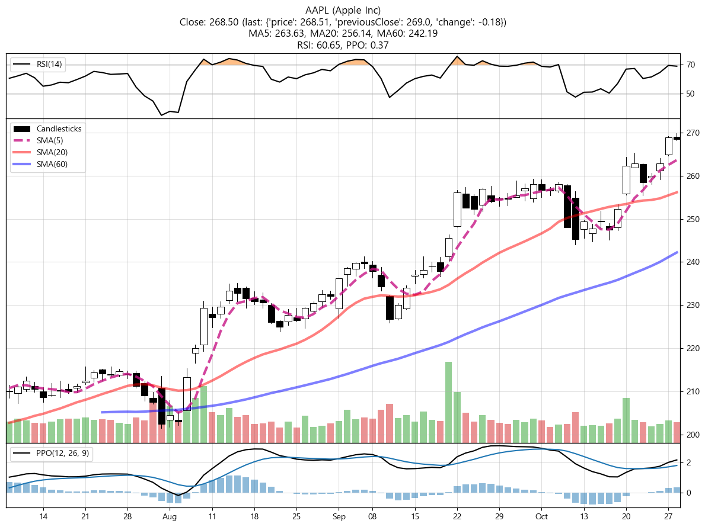

# Stock Strategy Backtesting and Analysis

## Overview
This project focuses on comparing the performance of individual stocks with benchmark indices, such as the S&P 500 (tracked via the VOO ETF). It provides tools to visualize and analyze cumulative returns, divergence metrics, and other key financial indicators, enabling users to understand the relative strength of specific stocks over time.

## Description
The backtesting engine simulates a monthly investment strategy where a fixed amount is consistently invested. The engine generates cumulative return comparisons between target stocks and the S&P 500 index (VOO). Additionally, the project offers various analysis tools to help you understand the stock’s historical performance, recent trends, and expected future performance.

Key metrics and outputs include:
- **Cumulative Total Return**: Tracks total returns of the stock and VOO for comparison.
- **Divergence**: Measures the difference between the stock's performance and the S&P 500 over time.
- **Relative Divergence**: Highlights the stock's position within its historical divergence range.
- **RSI and PPO**: Provides technical indicators to assess momentum and potential market trends.
- **Expected Return**: Projects the likely future performance over a 5 to 10-year period.

This project also includes recent stock news, analyst opinions, and a ranking system for sector-specific stocks based on their Expected Return.

## How It Works

The simulation and analysis are built around a few core processes:

1. **Monthly Investment Simulation**:  
   The project assumes a regular monthly investment in both the target stock and the S&P 500 (VOO). Over time, it compares the cumulative returns of the two. 

   - **Cumulative Return Comparison**: For each stock, a graph is generated comparing the cumulative return of the stock (tracked via the `rate_{ticker}_5D`) to that of the S&P 500 (via the `rate_VOO_20D`).

2. **Performance Metrics & Graphs**:
   The backtest generates multiple graphs and key performance metrics:
   
   
   - **Total Return (%)**: The final return percentage for the selected stock compared to the S&P 500.
   - **Divergence Metrics**:  
     - **Divergence**: The maximum, minimum, and current divergence from the S&P 500.
     - **Relative Divergence**: This metric positions the current divergence within a historical context. For example, a Relative Divergence of 90 means the stock is performing near the top of its historical range, relative to the S&P 500.

   - **Technical Indicators**:  
     - **RSI (Relative Strength Index)**: A momentum indicator used to determine whether a stock is overbought or oversold.
     - **PPO Histogram (Percentage Price Oscillator)**: A technical analysis tool used to gauge the momentum of a stock.

   - **Recent Divergence Trends**: The most recent divergence change, called the `Delta_Previous_Relative_Divergence`, provides insight into short-term trends, helping to identify whether the stock is trending upward or downward relative to the S&P 500.

   - **Expected Return**: Based on historical trends, the system provides an expected future return for the stock over the next 5 to 10 years, giving investors an idea of potential long-term performance.

4. **Performance over the Last 6 Months**:
   The project includes detailed visualizations for the past 6 months of stock performance, emphasizing:
   

   - Price trends (5, 20, and 60-day moving averages)
   - RSI and PPO indicators
   - Short-term divergence shifts

6. **Quarterly Earnings Review**:  
   The system also includes a review of the company's earnings over the past year. It examines whether the company met or missed expectations and considers how these financial results might affect future performance.

7. **Sector Rankings**:
   One of the key outputs of this project is the ranking of stocks by sector based on their Expected Return. This allows investors to compare the best-performing stocks across different sectors and prioritize investments accordingly.

## Example: How to Read the Analysis

1. **Stock Performance Comparison**:  
   The system generates a graph that compares the cumulative return of the chosen stock (let’s say **AAPL**) against the S&P 500 (VOO). The purple line represents AAPL’s return over time, while the green line represents the return of VOO.

2. **Divergence Analysis**:  
   At the end of the comparison period, the system will show you how much AAPL has diverged from the S&P 500. If AAPL has a divergence of +5%, this means AAPL outperformed the S&P 500 by 5% over the period.

3. **Recent Trends & Technical Analysis**:  
   - **RSI**: If AAPL has an RSI of 70, it suggests that the stock might be overbought and could be due for a correction.
   - **PPO**: The PPO histogram helps you understand whether the stock’s upward momentum is accelerating or slowing down.

4. **Earnings Review**:  
   If AAPL’s most recent quarterly earnings beat expectations, this could signal strength in the company’s fundamentals, potentially supporting continued stock growth.

5. **Sector Rankings**:  
   You can see how AAPL ranks against other tech stocks by Expected Return, helping you make more informed decisions about which stocks to prioritize for long-term investment.

## Additional Information
- **Recent News & Analyst Opinions**: The system aggregates recent news, providing insights from analyst reports, such as those from sources like FINBOLD, to give you a broader understanding of market sentiment.
- **Sector Trends**: Using data from the system’s divergence analysis, you can quickly identify which sectors are hot and which are underperforming based on divergence trends and Expected Return.

## Conclusion
This project provides a robust framework for backtesting stock strategies and understanding how individual stocks perform against broader indices like the S&P 500. By using this system, you can gain insights into both short-term trends and long-term projections, helping to make more informed investment decisions.
