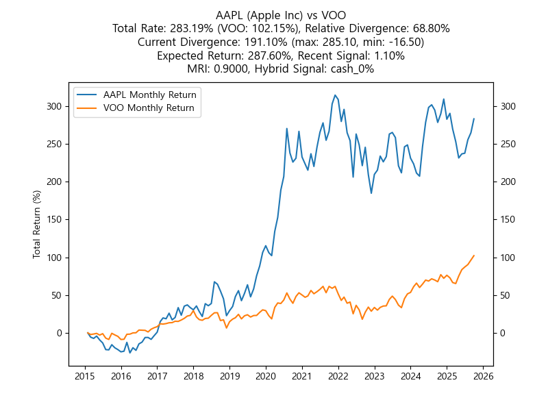

# Stock Strategy Backtesting and Analysis

## Overview
This project focuses on comparing the performance of individual stocks with benchmark indices such as the S&P 500 (tracked via the VOO ETF). It provides tools to visualize and analyze cumulative returns, divergence metrics, and other key financial indicators, enabling users to assess the relative strength of specific stocks over time.

## Description
The backtesting engine simulates a monthly investment strategy, where a fixed amount is consistently invested. The engine generates cumulative return comparisons between target stocks and the S&P 500 index (VOO). Additionally, it offers analysis tools to help you understand historical performance, recent trends, and expected future performance.

Key metrics and outputs include:
- **Cumulative Total Return**: Tracks the stock's total return compared to VOO.
- **Divergence**: Measures the performance gap between the stock and the S&P 500 over time.
- **Relative Divergence**: Highlights the stock's position within its historical divergence range.
- **Expected Return**: Projects the likely future performance over a 5 to 10-year period.

This project also includes recent stock news, analyst opinions, and a ranking system for sector-specific stocks based on their Expected Return.

## How It Works

1. **Monthly Investment Simulation**:  
   The project simulates a consistent monthly investment in both the target stock and the S&P 500 (VOO). Over time, it compares the cumulative returns of both. 

   - **Cumulative Return Comparison**: For each stock, a graph is generated comparing the cumulative return of the stock (tracked via the `rate_{ticker}_5D`) to the S&P 500 (via the `rate_VOO_20D`).

2. **Performance Metrics & Graphs**:
   The backtest generates multiple graphs and key performance metrics:

   

       
   

   - **Total Return (%)**: The final return percentage for the selected stock compared to VOO.
   - **Divergence Metrics**:  
     - **Divergence**: The maximum, minimum, and current divergence from the S&P 500.
     - **Relative Divergence**: Shows where the current divergence falls within the historical range.
   - **Expected Return**: Projects long-term returns for the stock based on historical data.

3. **Recent Trends & Technical Analysis**:
   The system tracks recent price movements and momentum indicators to identify short-term trends and potential market conditions:

   

      
   

   - **RSI (Relative Strength Index)**: A momentum indicator that identifies whether a stock is overbought or oversold.
   - **PPO Histogram (Percentage Price Oscillator)**: Gauges the stock’s momentum and the strength of trends.
   - **Recent Divergence Trends**: Tracks short-term divergence changes with `Delta_Previous_Relative_Divergence`.

4. **Performance Over the Last 6 Months**:
   The system provides visualizations for the last 6 months of stock performance, including:
   - Price trends (5, 20, and 60-day moving averages)
   - Short-term divergence shifts

5. **Quarterly Earnings Review**:  
   The system includes a review of the company’s earnings over the past year, analyzing whether the company met or missed expectations and how this may influence future performance.

6. **Sector Rankings**:
   The system ranks stocks within each sector based on their Expected Return, allowing investors to compare the top-performing stocks across different sectors.

## Example: How to Read the Analysis

1. **Stock Performance Comparison**:  
   The system generates a graph comparing the cumulative return of a selected stock (e.g., **AAPL**) against the S&P 500 (VOO). The purple line represents AAPL’s return, and the green line represents VOO’s return.

2. **Divergence Analysis**:  
   The system tracks how much AAPL's performance diverges from the S&P 500. A positive divergence means AAPL has outperformed the S&P 500 by a given percentage.

3. **Recent Trends & Technical Analysis**:  
   - **RSI**: An RSI of 70 or higher suggests the stock may be overbought, while a value under 30 suggests oversold conditions.
   - **PPO**: The PPO histogram shows the strength and direction of momentum.

4. **Earnings Review**:  
   If AAPL's recent quarterly earnings beat expectations, it can indicate positive momentum, potentially supporting further stock growth.

5. **Sector Rankings**:  
   You can compare AAPL against other tech stocks in terms of Expected Return to prioritize long-term investments.

## Additional Information

- **Recent News & Analyst Opinions**: The system aggregates recent news and analyst reports, providing insights into market sentiment for the stock.
- **Sector Trends**: Using divergence analysis, the system highlights hot and underperforming sectors based on current trends and Expected Return.

## Conclusion
This project offers a robust framework for backtesting stock strategies, comparing individual stock performance to broader indices like the S&P 500, and providing insights into both short-term and long-term trends. These analyses help investors make more informed investment decisions.
